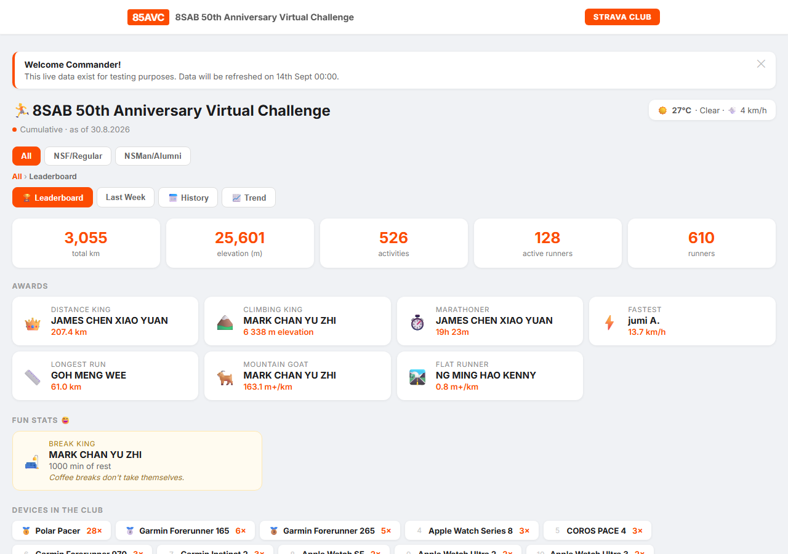
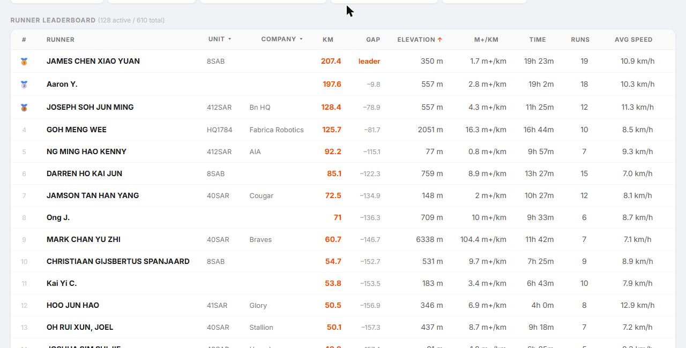
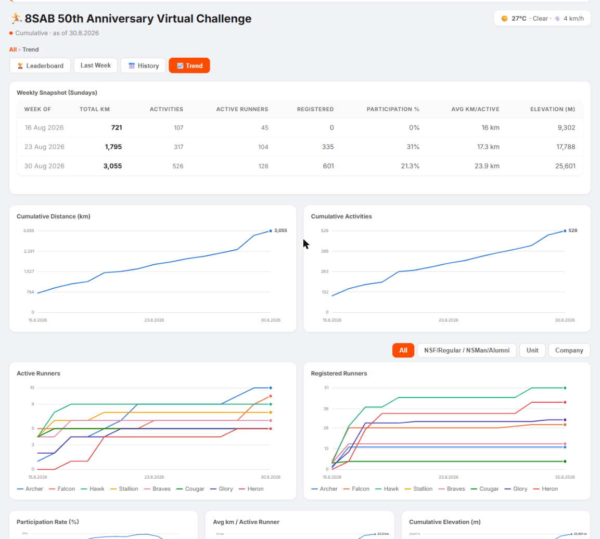

# 8SAB 50th Anniversary Virtual Challenge — Strava Dashboard

[](https://github.com/choonyongchan/BdeAnnivVirtChallenge/actions/workflows/test.yml)
[](https://codecov.io/gh/choonyongchan/BdeAnnivVirtChallenge)
[](https://choonyongchan.github.io/BdeAnnivVirtChallenge/)

**→ [View the live dashboard](https://choonyongchan.github.io/BdeAnnivVirtChallenge/)**

A live leaderboard for the 8SAB 50th Anniversary Virtual Challenge. A scheduled job
reads the challenge's Strava club, matches each athlete against the unit nominal
roll, and writes the whole dashboard into one static `index.html` on GitHub Pages.
It refreshes every hour. There is no server and no database: every sort, filter,
chart, and history view runs in your browser off data baked into the page.



---

# User Guide

Open [the dashboard](https://choonyongchan.github.io/BdeAnnivVirtChallenge/) in any
browser. Nothing to install, no login.

The top of the page shows club totals (distance, elevation, activities, active
runners, registered runners) and award cards: Distance King, Climbing King,
Marathoner, Fastest, Longest Run, Mountain Goat, Flat Runner, and Break King for
the most time spent stopped mid-activity. A card appears only once someone
qualifies.

Below that is the runner leaderboard. It lists every registered runner, including
those who haven't run yet. Click a column to sort; use the Unit and Company menus
to filter. Alongside it sit unit rankings, company rankings, and a registration
tree, all built from the roll. Three tabs (All, NSF/Regular, NSMan/Alumni) split
everyone by `Type of service`.

The History picker opens a calendar for any past date's cumulative standings, with
a shortcut to last week. The Trend view adds a weekly Sunday snapshot table and
cumulative charts for distance, activities, runners, participation rate, and
elevation, with a breakdown by group, unit, or company.

A recording-device breakdown, local weather, and a dismissible announcement banner
round out the page.





---

# Developer Guide

## Architecture

Strava shut off its public club API in 2026, so the pipeline drives a logged-in
browser instead. One `python -m src.main` run does five things in order:

```
python -m src.main
  ├─ check_auth()                 src/main.py          is src/auth_state.json a valid session?
  ├─ ActivityScraper().scrape()   src/activities/      fetch the club feed in a real browser
  │                                                    → append new rows to activities.csv
  ├─ MemberScraper().scrape()     src/members/         page through the club member list
  │                                                    → append new athletes to members.csv
  ├─ generate.run()               src/dashboard/       load the 3 CSVs + config.yaml + weather
  │      stats.py   → totals, awards, leaderboard, devices
  │      names.py   → match truncated Strava names to the roll (unit / company / service)
  │      renderer.py→ substitute into template.html
  │                                                    → write index.html
  └─ publish_dashboard()          src/main.py          commit and push index.html
```

Both scrapers share one Playwright session (`src/strava_session.py`), which spoofs
a normal browser and retries a failed fetch twice with backoff; there's no OAuth
and no API tokens. Three append-only CSVs feed the generator — activities,
members, and the nominal roll (roster) — and `NominalRoll` in
`src/dashboard/names.py` resolves Strava's truncated club-feed names (e.g.
`"Siva R."`) back to the right roster entry. `renderer.render()` substitutes the
computed data into `src/dashboard/template.html` to produce `index.html`, which is
generated output — edit the template and regenerate, since direct edits to
`index.html` are overwritten.

## Key commands

```bash
git clone https://github.com/choonyongchan/BdeAnnivVirtChallenge.git
cd BdeAnnivVirtChallenge
pip install -r requirements.txt
python -m playwright install chromium    # add --with-deps on Linux
```

| Command | Does |
|---|---|
| `python -m src.login` | Opens a visible browser to log in to Strava; writes `src/auth_state.json`, the session every scraper reuses. |
| `python -m src.nominal_roll.nominal_roll "<raw FormSG export.csv>"` | Cleans a registration export into `src/nominal_roll/nominal_roll.csv`. Without this file the dashboard still builds, but nobody gets a unit, company, or full name. |
| `python -m src.main` | Runs the full pipeline: scrape, generate, and push. |
| `python -m src.dashboard.generate` | Rebuilds `index.html` from the CSVs you already have, without scraping or touching git. |
| `python -m pytest test/ -q` | Runs the test suite (`test/unit`, `test/integration`, `test/e2e`). Every fixture is synthetic. |

`index.html` is self-contained — open the file directly, no local server needed.

Settings live in `src/config.yaml` and nowhere else. There is no `.env` and the
code reads no environment variables; CI supplies secrets separately.

| Key | Default | Purpose |
|---|---|---|
| `club.name` | `8SAB 50th Anniversary Virtual Challenge` | Dashboard title |
| `club.id` | `2211123` | Strava club the scrapers read |
| `challenge_start` | `2026-09-01` | Activities before this local date don't count (code default is `2026-09-14`; the yaml value wins) |
| `timezone` | `Asia/Singapore` | Display timezone for the dashboard |
| `weather.latitude` / `weather.longitude` | `1.3835` / `103.7478` | Weather widget location |
| `announcement_path` | `src/announcement.md` | Banner source file |
| `browser.channel` | `""` | Empty = Playwright's bundled Chromium; `chrome`/`msedge` drive a system browser |
| `browser.headless` | `true` | Set `false` to watch a scrape |

To show the banner, put a title on the first line of `src/announcement.md` (a
leading `#` is stripped) and the body below it. An empty or missing file hides it.
Content is HTML-escaped.

## How it deploys

`.github/workflows/update.yml` builds and deploys the dashboard on the hour
(`cron: '0 * * * *'`; GitHub can delay a scheduled run 5–20 minutes) and on demand
from **Actions → Update and Deploy Strava Dashboard → Run workflow**. It runs the
tests, installs Chromium for Playwright, decodes the two secrets below, runs
`python -m src.main`, commits `activities.csv`, `members.csv`, and `index.html`
back to `main`, then publishes `index.html` (and the `user-count.json` badge data
file) to GitHub Pages via `actions/deploy-pages`.

| Secret | Contents |
|---|---|
| `AUTH_STATE` | Base64 of `src/auth_state.json`. Refresh with `python -m src.login`, then re-encode. |
| `NOMINAL_ROLL` | Base64 of `src/nominal_roll/nominal_roll.csv`. |

Publishing needs **Settings → Pages → Source = GitHub Actions**. `index.html` is
the entire site. The CSV ledgers are committed for history; `auth_state.json` and
`nominal_roll.csv` never are.

A separate `.github/workflows/test.yml` runs the suite with coverage on every push
and pull request to `main` and uploads results to Codecov — this is what the
badges at the top track. Codecov needs a `CODECOV_TOKEN` repo secret from
[codecov.io](https://codecov.io/) to upload.

## Project layout

```
index.html                       generated dashboard; don't edit
requirements.txt
src/
  main.py                        pipeline entry point (scrape → generate → publish)
  login.py                       one-off manual Strava login → src/auth_state.json
  strava_session.py              shared Playwright session + retry/backoff
  config.py / config.yaml        settings (no secrets, no env vars)
  announcement.md                optional banner text
  auth_state.json                session cookies (gitignored; from AUTH_STATE)
  activities/
    activities.py                scrape club feed → append-only ledger
    activities.csv               activity ledger (committed)
  members/
    members.py                   scrape member list → append-only ledger
    members.csv                  member ledger (committed)
  nominal_roll/
    nominal_roll.py               raw FormSG export → cleaned roster
    nominal_roll.csv             roster (gitignored; from NOMINAL_ROLL)
  dashboard/
    generate.py                  load CSVs → compute → render → write index.html + src/user-count.json
    stats.py                     statistics engine (totals, awards, leaderboard)
    names.py                     NominalRoll, truncated-name resolution
    renderer.py                  token substitution into template.html
    weather.py                   Open-Meteo current weather (optional)
    template.html                dashboard markup, styles, and JS; edit this
  docs/                          README screenshots
test/                            pytest suite (unit / integration / e2e)
.github/workflows/update.yml     hourly scrape + generate, then deploy to Pages
.github/workflows/test.yml       tests + coverage on every push/PR
```

## Contributing

You need Python 3.10 or newer (the code uses `X | None` annotations; CI pins
3.14), a Strava account in the club, and the club set to show member activity.

Run `python -m pytest test/ -q` (or scope to `test/unit`, `test/integration`,
`test/e2e`) from the repo root before you push — `test.yml` runs it in CI, but
`update.yml`'s hourly run fails outright if the suite breaks. `pytest` is in
`requirements.txt`; every fixture is synthetic, so the real roster and the real
FormSG export are never read.

## Troubleshooting

**"STRAVA RE-AUTH REQUIRED", or a scrape reports the session expired or was
blocked.** Run `python -m src.login`, re-encode `src/auth_state.json`, and update
the `AUTH_STATE` secret.

**"No members parsed".** Usually the same expired session. If the login is fresh,
Strava changed its members-page markup and the regex in `src/members/members.py`
needs updating.

**Everyone shows up with no unit, company, or full name.** `nominal_roll.csv` is
missing. Rebuild it locally with `nominal_roll`; in CI, check the
`NOMINAL_ROLL` secret.

**One runner's stats are missing or under the wrong unit.** Their Strava display
name doesn't match the `STRAVA username` column in the roll. Strava may truncate it
differently than the roll expects.

**No weather.** Check `weather.latitude` / `weather.longitude`. The widget is
optional and the dashboard works without it.

**Scheduled runs stopped.** GitHub disables cron on repos with no recent activity.
Re-enable it from the Actions tab.

---

## Licence

MIT.

Data from the [Strava API](https://developers.strava.com/) and weather from
[Open-Meteo](https://open-meteo.com/). Based on
[DatabenderSK/strava-club-dashboard](https://github.com/DatabenderSK/strava-club-dashboard).
