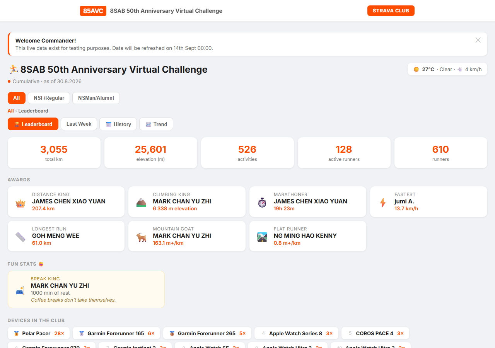
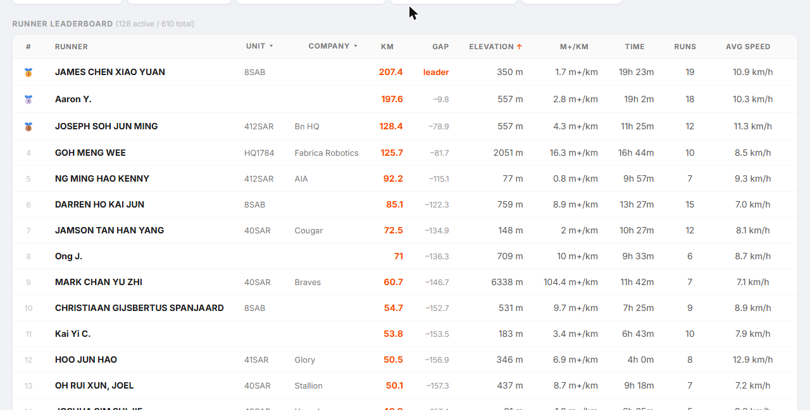
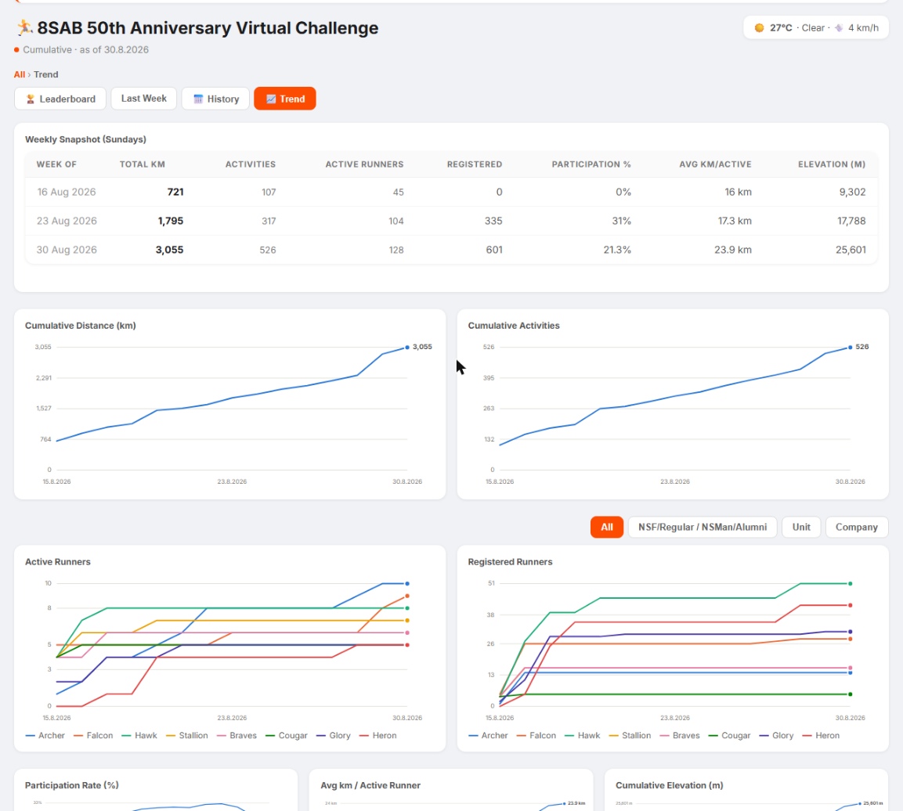

# 8SAB 50th Anniversary Virtual Challenge — Strava Dashboard

[](https://github.com/choonyongchan/BdeAnnivVirtChallenge/actions/workflows/test.yml)
[](https://codecov.io/gh/choonyongchan/BdeAnnivVirtChallenge)
[](https://choonyongchan.github.io/BdeAnnivVirtChallenge/)

**[Open the live dashboard](https://choonyongchan.github.io/BdeAnnivVirtChallenge/)**

A leaderboard for the 8SAB 50th Anniversary Virtual Challenge Strava club. Every hour a
job reads the club on Strava, matches each member to the unit nominal roll, and
publishes one static page to GitHub Pages. There is no server and no login: sorting,
filtering, charts and history all run in your browser.



This page is the user guide. To change or run the code, read the
[Developer Guide](docs/DeveloperGuide.md).

## Using the dashboard

Open [the dashboard](https://choonyongchan.github.io/BdeAnnivVirtChallenge/) in any
browser, on a phone or a desktop. Nothing to install. You can add it to your home screen.

**Totals.** The top row shows the club's total distance, elevation and activities,
how many members have run, and how many members the club has. The member total is
the number Strava shows on the club page.

**Groups.** *All*, *NSF/Regular* and *NSMan/Alumni* split everyone by their type of
service on the nominal roll. Anyone not on the roll counts in *All* only.

**Awards.** Distance King, Climbing King, Marathoner, Fastest, Longest Run, Mountain
Goat, Flat Runner and Break King (most time stopped mid-run). A card appears once
someone qualifies.

**Leaderboard.** Every member, including those who haven't run yet. Click (or Tab to
and press Enter on) a column heading to sort; use the Unit and Company menus to filter.
Below it (beside it on a wide screen) the *Units*, *Companies* and *Registration*
buttons switch between the unit rankings, company rankings and registration tree. On a
phone, the runner's name stays in view while you swipe across the leaderboard's columns.

**Last Week, History and Trend.** *Last Week* shows standings as of last Sunday.
*History* opens a calendar of past standings, one per day. *Trend* shows a weekly table
and cumulative charts for distance, activities, runners, participation and elevation,
by group, unit or company.





## What counts, and how fresh it is

- **Foot sports only:** Run, Trail Run, Virtual Run, Walk and Hike, from the challenge
  start date (14 Sep 2026). Rides, swims and workouts don't count.
- **Updated hourly.** The time of the last update is in the page footer.
- **Your totals are Strava's figures.** If you are in the club leaderboard's top 100,
  your week matches it exactly. Otherwise your week is the sum of your activities. Each
  night these are re-checked against your Strava profile.
- **An activity is missing?** It needs to be visible to the club (privacy "Everyone",
  or "Followers" with the organiser following you), and dated in the challenge. Runs
  uploaded more than a week late are only picked up by a full rebuild. Ask the
  organiser.
- **Runners who share a Strava name appear as one.** If two or more members use the
  same Strava display name, the leaderboard shows a single row with their distance,
  runs and time combined. Club totals are unaffected. To appear separately, change your
  Strava display name so it is unique.
- **Your unit or name is wrong?** Your Strava display name doesn't match the
  `STRAVA username` you registered with. Ask the organiser to update the roll.

## Running it (organiser)

The pipeline runs on one Windows machine. Setup, once:

```powershell
git clone https://github.com/choonyongchan/BdeAnnivVirtChallenge.git
cd BdeAnnivVirtChallenge
python -m venv .venv
.venv\Scripts\python -m pip install -r requirements.txt
.venv\Scripts\python -m playwright install chromium
.venv\Scripts\python -m backend.login                       # log in to Strava in the window that opens
.venv\Scripts\python -m backend.nominal_roll.nominal_roll "<FormSG export.csv>"
```

Then register the hourly task (it runs at minute 45; the 23:45 run also does the
nightly profile scan):

```powershell
$Action = New-ScheduledTaskAction -Execute "powershell.exe" -Argument '-NoProfile -ExecutionPolicy Bypass -File "<repo>\scripts\run_pipeline.ps1"'
$next45 = Get-Date -Minute 45 -Second 0
if ($next45 -le (Get-Date)) { $next45 = $next45.AddHours(1) }
$Trigger = New-ScheduledTaskTrigger -Once -At $next45 -RepetitionInterval (New-TimeSpan -Hours 1) -RepetitionDuration (New-TimeSpan -Days 3650)
$Settings = New-ScheduledTaskSettingsSet -DontStopOnIdleEnd -MultipleInstances IgnoreNew -StartWhenAvailable
$Principal = New-ScheduledTaskPrincipal -UserId $env:USERNAME -LogonType S4U -RunLevel Limited
Register-ScheduledTask -TaskName "BdeAnnivVirtChallenge-HourlyPipeline" -Action $Action -Trigger $Trigger -Settings $Settings -Principal $Principal
```

Each run scrapes Strava, regenerates the page, commits it and pushes; GitHub
Pages redeploys. Logs go to `logs/`. Check the task with
`Get-ScheduledTaskInfo -TaskName "BdeAnnivVirtChallenge-HourlyPipeline"`.

| Task | Command |
|---|---|
| Run the pipeline now | `.venv\Scripts\python -m backend.main` (`--full` adds the nightly profile scan) |
| Rebuild every week since the start | `.venv\Scripts\python -m backend.main --setup` |
| Rebuild the page only, no scraping | `.venv\Scripts\python -m frontend.generate` |
| Add new registrants to the roll | `.venv\Scripts\python -m backend.nominal_roll.nominal_roll "<export.csv>"` |
| Show a banner | Put a title on the first line of `frontend/announcement.md` and the text below it. Empty the file to hide it. |

Settings (club, challenge start, schedule, weather location) are in
`shared/config.yaml`.

### When something goes wrong

**"STRAVA RE-AUTH REQUIRED", or "session expired or blocked".** The Strava login
expired. Run `.venv\Scripts\python -m backend.login` and log in again.

**"Strava rate-limited (HTTP 429)".** The nightly scan asked too much. What it fetched
is saved; the next night carries on. Nothing to do.

**"roster lists N athletes but the headline says M".** Someone joined or left while the
members list was being read. The next hour usually tallies; nothing to do unless it
persists for a day.

**Everyone has no unit or full name.** `backend/nominal_roll/nominal_roll.csv` is
missing. Re-run the nominal roll command.

## Licence

MIT. Activity data from [Strava](https://www.strava.com/), weather from
[Open-Meteo](https://open-meteo.com/). Based on
[DatabenderSK/strava-club-dashboard](https://github.com/DatabenderSK/strava-club-dashboard).
